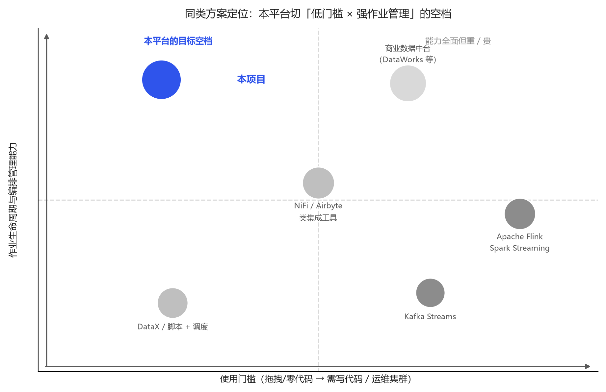
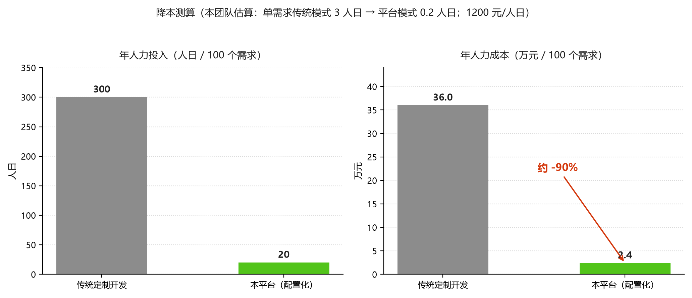

# 通用流处理任务管理平台 —— 项目创意与价值分析

> 版本：v1.0　对应交付物：《项目创意与价值分析.docx》
> 定位：回应赛题评分项「项目创意」——**市场需求分析合理性、创意独特性、商业价值与社会应用价值**。
> 说明：本文中凡涉及外部市场/成本的数据，均标注为"行业公开口径"或"本团队估算（含假设）"，
> 未标注者为本项目实测数据（出处见文末对照表）。

---

## 1. 问题从哪来：一个真实且反复发生的需求

### 1.1 场景：银行科技部门里最"没技术含量"却最耗人的活

在银行的科技条线里，有一类需求长年高频出现，且模式高度固定：

- **流量接入**：把上游某个系统的数据落到下游库表 / 消息队列；
- **字段补数**：读取时缺维度字段，需要到 Redis / 维表里补上再写出；
- **格式转换**：上下游对格式约定不同，需要 XML↔JSON、定长↔分隔符互转；
- **多路转发**：同一份数据要同时写 Kafka、MySQL、文件，供不同下游使用；
- **字段脱敏**：合规要求下，手机号/证件号等敏感字段必须脱敏后才能出域。

这类需求的特点是：**单个需求的逻辑不超过"读→加工→写"三步，但需求数量多、变更频繁、分布在各系统各团队**。

### 1.2 现有三条路，各有代价

| 做法 | 代价 |
|---|---|
| 在业务系统里各写一段 ETL 代码 | 重复建设；逻辑散落难以审计；一个人离职就没人看得懂；测试与上线流程各不相同 |
| 上重型计算平台（Flink/Spark 作业） | 能力过剩——为了"读一个 Kafka 写一个 MySQL"要养一套集群 + 一支会写流计算代码的团队 |
| 用调度平台 + 脚本（crontab/DataX 等） | 面向"批"，不是面向"流"；缺作业生命周期、缺可视化、缺横向扩展与故障自愈 |

于是形成了一个尴尬的中间地带：**重型平台太重、裸脚本太糙**，而这类需求恰恰是量最大、最需要被"标准化"的一类。

### 1.3 需求真实性的三个佐证

1. **赛题本身即是需求的投影**：A22 赛题要求"通用流处理任务管理平台"，并指定了 MySQL / CSV / Excel / Kafka 输入输出、Redis 补数、HDFS/PostgreSQL/Oracle 等扩展数据源——这正是 1.1 节那张需求清单。
2. **需求可以被"模式化"**：我们把这类需求抽象为 `输入控件 → 处理控件 → 输出控件` 的三段结构，20 个内置控件即可覆盖赛题列举的全部场景（7 输入 + 6 处理 + 7 输出）。
3. **痛点可以被量化**：一次典型需求的交付物，本应是"填一个表单 + 点一下上线"，而不是"写代码 + 打包 + 走变更流程"（成本对比见 §5.1）。

---

## 2. 市场分析：为什么是现在

### 2.1 需求侧：数据加工量在涨，而"加工需求的形态"没变

数据要素市场化、业务系统持续上新、监管报送口径频繁调整——三者共同推高了"数据搬运与变形"的需求总量。而这类需求的技术形态多年来几乎没变：**读取、清洗、补全、转换、分发**。需求总量上升 + 形态稳定 = **适合被平台化、产品化**。

### 2.2 供给侧：现有工具留下了明显的空档

- 计算引擎（Flink / Spark / Kafka Streams）强在"计算"，弱在"开箱即用的业务化编排"，且门槛高；
- 数据集成工具（Airbyte / DataX / SeaTunnel）强在"连接器"，弱在"作业生命周期管理 + 可视化编排 + 实时流语义"；
- 商业数据中台（DataWorks / FineDataLink 等）能力全面，但**重、贵、需整体引入**，且对中小规模场景过重。

**空档即机会**：一个"轻量、零代码、可水平扩展、能一键部署"的流式加工平台。

### 2.3 时间窗口：信创与自主可控

在信创背景下，金融行业对"自主可控、可审计、可私有化部署"的基础软件有明确偏好。本项目**全栈可私有化部署**（Docker Compose 一键起，数据不出域），Java 21 + 开源组件构成，无商业闭源依赖，天然适配这一诉求。

---

## 3. 同类方案对比：我们切的是哪一块

> 下表按"公开资料 + 本项目的实测体验"整理，用于说明定位差异，非对各家产品能力的完整评价。

| 维度 | Flink / Spark Streaming | Kafka Streams | NiFi / Airbyte 类集成工具 | DataX / 脚本 + 调度 | **本项目** |
|---|---|---|---|---|---|
| 定位 | 通用流/批计算引擎 | 消息流处理库 | 数据集成与流转 | 离线数据同步 | **流式数据加工任务管理平台** |
| 使用门槛 | 高（写代码、懂窗口/状态语义） | 高（写代码） | 中 | 低（配脚本） | **低（拖拽 + 填表单，零代码）** |
| 可视化编排 | 无（代码即作业） | 无 | 部分有 | 无 | **有（React Flow 画布 + DAG 校验）** |
| 作业生命周期 | 需自建（提交/监控/重启） | 需自建 | 弱 | 弱/依赖外部调度 | **内置（草稿→上线→运行→下线，含实例与吞吐监控）** |
| 横向扩展 | 强（需集群） | 中（分区内并行） | 中 | 一般 | **中强（无状态 Worker + 作业分片，扩 Worker 即扩吞吐）** |
| 部署成本 | 高（集群 + 调优） | 低（库依赖） | 中 | 低 | **低（Docker Compose 一键起 6 容器）** |
| 一致性语义 | exactly-once（可配） | at-least-once / 事务 | at-least-once | 批 | **at-least-once（文件链路零重复）** |
| 环境适配 | 需 JVM 集群资源 | 需 Kafka | 视产品 | 视产品 | **8vCPU/32G 单机即可跑满赛题场景** |

**结论**：我们不去和 Flink 比"计算能力"，而是补上"**把固定模式的流式加工需求，用零代码方式、分钟级交付、且能水平扩展**"这一层。二者是互补关系——底层机制（流水线、有界队列背压、分片、断点续传）同源，我们以虚拟线程做了轻量化实现。

---

## 4. 差异化与创新点

### 创新点 1｜"参数即 Schema"：新增数据源只写一个 Java 类，前端零改动

控件用统一 SPI 接口（Source / Processor / Sink），参数以 **JSON Schema** 声明。前端按 Schema **动态渲染**表单（string / number / boolean / array / 枚举），后端按同一份 Schema 校验。

> 效果：从"新增一个数据源要动前后端三处代码"降为"**实现一个类 + 声明一份 Schema**"。这是"通用"二字的落地方式。

### 创新点 2｜MySQL 即协调中心：零中间件依赖的调度

不引入 ZooKeeper / Raft，用 MySQL 承担协调：Worker 通过心跳表注册，调度器通过**状态字段 + 乐观锁**（`UPDATE ... WHERE id=? AND status='PENDING'`）抢占分片，多控制面副本亦安全。

> 效果：整套系统只需 MySQL 一个外部依赖，`docker compose up -d` 即可从零到可演示；同时保留了控制面横向扩展的能力。

### 创新点 3｜"分片"作为一等抽象：同一套模型覆盖四类数据源

并行度 = 分片数。四种切分策略统一到同一抽象下：

| 源类型 | 切分方式 | 关键设计 |
|---|---|---|
| Kafka | 按分区 | 消费组 rebalance 自动分配，不显式绑定；支持按位点续读 |
| CSV / HDFS | 按字节区间 | 行边界对齐；**仅 CSV 支持字节偏移断点续传**（HDFS 不支持，见概要设计 §7.1） |
| Excel(.xlsx) | 按数据行序号 | xlsx 是压缩容器不可随机定位，读 `<dimension>` 定行数，越过区间即中断解析 |
| JDBC | 按分片列取值区间 | 探测 `MIN/MAX` 均分，区间谓词**下推可走索引**；未填 `shardColumn` 时**宁可拒绝 400 也不放 N 倍脏数据**；不支持断点续传 |

> 效果：分片能力不是"某一种源的特性"，而是平台的**统一能力**，且对不安全用法做**兜底拒绝**而非静默出错。

### 创新点 4｜轻量但完整的可靠性设计

- **断点续传**：按源区分——CSV 按字节偏移、Excel 按行号、Kafka 按消费位点；HDFS 与 JDBC 源不支持（分片 ≠ 断点，完整矩阵见《概要设计》§7.1）；
- **fencing token 防脑裂**：每次（重）派发令牌 +1，Worker 上报须携带，过期上报被拒——网络分区下"假死"的旧 Worker 无法双写；
- **控制面与数据面分离**：控制面不碰数据，Worker 无状态，心跳超时 30s 自动重派分片。

> 效果：在"不引入分布式事务"的前提下，用**令牌 + 确认偏移**两个朴素机制，换到了工程上够用的可靠性。

### 创新点 5｜虚拟线程三段流水线：把"高性能"做成默认值

`Source 线程 →(有界队列)→ Process 链 →(有界队列)→ Sink 线程`，队列满即天然背压；批量传递避免逐行开销，文件 8MB 缓冲 I/O、JDBC batch insert。

> 实测：5000 万行 / 5.9GB 端到端 **50.8s（98.4 万行/s）**。
>
> 内存方面另据 Kafka 长跑实测，长时间运行时单 Worker 内存稳定在 **507~520MiB**（见 docs/12）；
> 5000 万行 CSV 档只验证了「处理全程不 OOM」，未单独测内存峰值，两者不是同一组数据。

---

## 5. 商业价值

### 5.1 降本：把"开发"变成"配置"

**成本模型（本团队估算，含假设，仅用于说明量级差异）**

假设：某银行科技部门每年新增 **100** 个数据加工类需求，单需求传统开发模式需后端 3 人日（编码 + 联调 + 测试 + 上线变更），人力综合成本按 **1200 元/人日** 计。

| 做法 | 单需求投入 | 100 需求/年 | 说明 |
|---|---|---|---|
| 传统定制开发 | 3 人日 | **300 人日 ≈ 36 万元/年** | 每次都要写代码、走测试与变更 |
| 本平台 | 0.2 人日（配置 + 验证） | **20 人日 ≈ 2.4 万元/年** | 拖拽编排 + 一键上线，无代码变更 |

> **量级结论**：在这套假设下，人力投入下降约 **90%**。该比例会随需求复杂度变化，但"周级 → 分钟级"的交付节奏差异是结构性的。
> 更关键的是**变更成本**：口径调整时，传统模式要重新走开发链路，平台模式改一个参数、重上一次线即可。

### 5.2 落地形态与商业模式

| 形态 | 说明 |
|---|---|
| 私有化交付（主形态） | 以容器镜像/Compose 交付到行内，数据不出域，符合金融合规 |
| 控件生态 | 第三方按 SPI 贡献控件（新增数据源/行业算法），形成"平台 + 插件"的扩展模式 |
| 运维服务 | 部署、调优、控件定制与培训 |
| 内部中台化 | 作为行内统一的数据加工入口，收敛各系统的重复 ETL |

### 5.3 国产化替代价值

- 全栈**可私有化部署**，无强绑定云厂商的托管服务；
- 语言与组件（Java 21、Spring Boot、MySQL、Kafka、Redis、HDFS Client）**均为开源、可审计、可替换**；
- 单机即可承载赛题规模的负载，**降低中小机构的引入门槛**。

---

## 6. 社会应用价值

### 6.1 让"数据合规"变成默认能力

数据脱敏控件与 MySQL `SHA2` 双向互验一致，脱敏动作成为编排里的**一个节点**而非各系统各自的临时代码——合规要求从"事后靠人查"部分转为"事前由平台保证"。

### 6.2 降低数字化转型的门槛

零代码编排让"懂业务但不懂编程"的人也能独立完成数据加工任务的搭建；插件化让新数据源的接入成本从"改框架"降到"写一个类"。这直接扩大了能参与数据建设的人群范围。

### 6.3 可复用的工程范式

"参数即 Schema 的动态表单"、"用数据库做轻量协调"、"分片作为一等抽象"、"令牌 + 确认偏移换可靠性"——这些做法不限于金融场景，对一切"**固定模式、高频重复**"的系统建设需求都有参考价值。

---

## 7. 与赛题验收项的对应

| 赛题要求 | 本项目实现 | 证据 |
|---|---|---|
| 用户管理 / 控件管理 / 作业管理 | 三个模块 + 权限（ADMIN/普通用户） | 概要设计 §4 |
| 可视化拖拽编排 | React Flow 画布 + DAG 校验 + JSON Schema 动态表单 | 概要设计 §4.3、§6 |
| 基础数据源 MySQL/CSV/Excel/Kafka | 内置控件覆盖 | 概要设计 §5.3 |
| XML↔JSON、字段拼接 | 内置处理控件 | 处理控件测试报告（62 项断言全过） |
| 挑战项：Redis 补数、HDFS/PG/Oracle | 扩展控件 + SPI 机制 | 处理控件测试报告、端到端集成测试报告 |
| 横向扩展 | 无状态 Worker + 作业分片 | 性能测试报告 §4.2 |
| 性能（赛题基准 8VC/32G/机械盘，csv→拼接→csv） | 5000 万行 50.8s / 98.4 万行/s（**实测环境为测试机 A**，环境差异与跨机器不可比说明见性能测试报告 §2.1、§6 与《部署文档》§8.1） | 性能测试报告 §4.1–4.2 |
| 可靠性与容错 | 断点续传 + fencing token + 故障自愈 | 数据质量与异常测试报告 |

---

## 8. 局限与演进路线

**已知边界（如实披露）**

1. 一致性语义为 **at-least-once**（非 exactly-once），故障恢复允许一个上报周期内的重复，需下游幂等；
2. 当前为 **fail-fast**：单行坏数据会导致整作业失败，暂无"坏行跳过 + 死信队列"模式；
3. 控制面上报接口在高并发下存在 **N+1 聚合查询**隐患（已定位，未修）；
4. 横向扩展实测仅覆盖 4 个数据点，尚无多物理机矩阵（见整改清单 T4）。

**演进路线**

① 两阶段提交 Sink → exactly-once；② 上报接口批量聚合优化；③ 坏行跳过 + 死信队列；④ 指标接入 Prometheus/Grafana；⑤ 控件市场与版本化分发。

---

## 9. 小结

> 一句话：**我们不为"更高的计算性能"再造一个 Flink，而是为"最常见的那类数据加工需求"造一个零代码、分钟级交付、可水平扩展、能一键部署的平台——它填的是重型引擎与裸脚本之间的空档。**

- **需求真实**：赛题即需求投影，20 个控件覆盖全部指定场景；
- **创意独特**：参数即 Schema、MySQL 即协调中心、分片作为一等抽象、令牌+确认偏移的轻量可靠性；
- **价值可量化**：在给定假设下人力投入下降约 90%，交付节奏由"周级"变为"分钟级"；
- **社会价值**：合规能力前置、降低数字化门槛、形成可复用的工程范式。

---

## 附：数据出处对照

| 数据 / 结论 | 出处 |
|---|---|
| 20 个内置控件（7 输入 + 6 处理 + 7 输出） | docs/01-概要设计.md §5.3、README.md |
| 5000 万行 / 5.9GB / 50.8s / 98.4 万行/s（6 分片×3 Worker） | docs/05-性能测试报告.md §4.1–4.2 |
| 1000 万行单分片 38.5s / 26.0 万行/s；4 分片 16.2s（2.4×） | docs/05-性能测试报告.md §4.1–4.2 |
| Worker 内存峰值 507~520MiB | docs/12-数据质量与异常测试报告.md |
| 处理控件 62 项断言全过 | docs/11-处理控件测试报告.md |
| 端到端 5 场景全过、扇出双写一致 | docs/08-端到端集成测试报告.md |
| 分段切分策略（Kafka/CSV/Excel/JDBC） | docs/01-概要设计.md §5、README.md |
| 断点续传 / fencing token / 故障自愈 | docs/02-数据库设计.md §3、docs/14-答辩汇报指南.md |
| 成本模型与市场判断 | **本团队估算/行业公开口径（含假设），非实测数据** |
