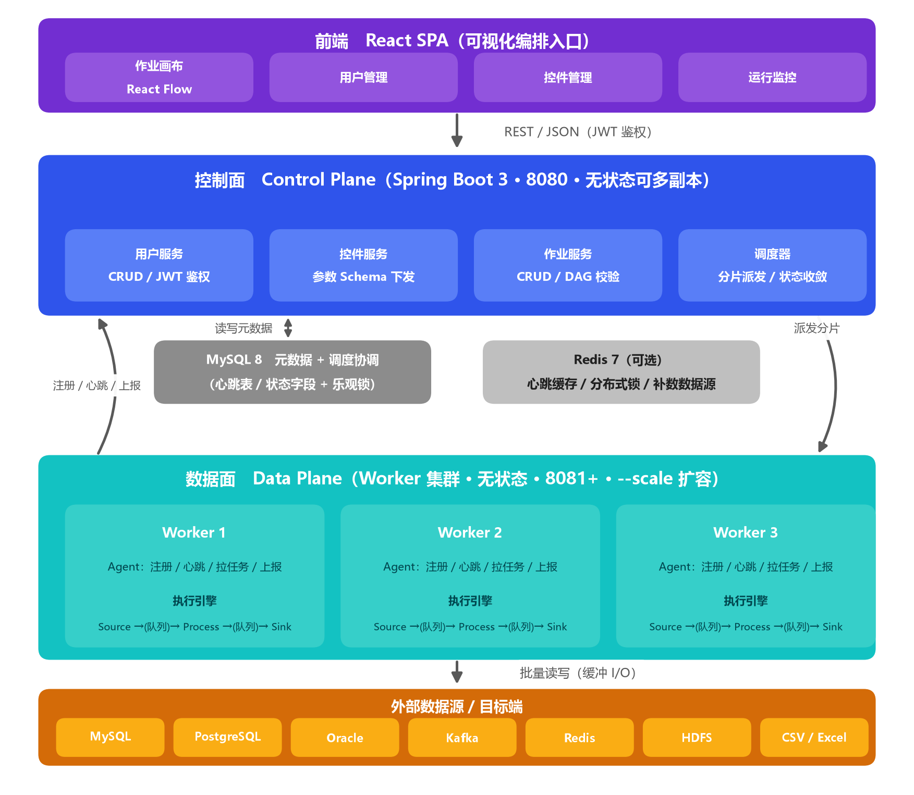
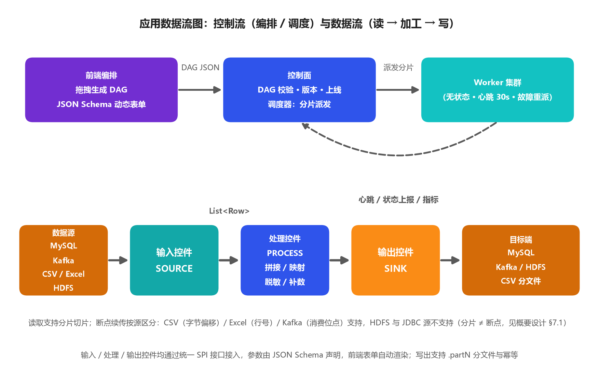
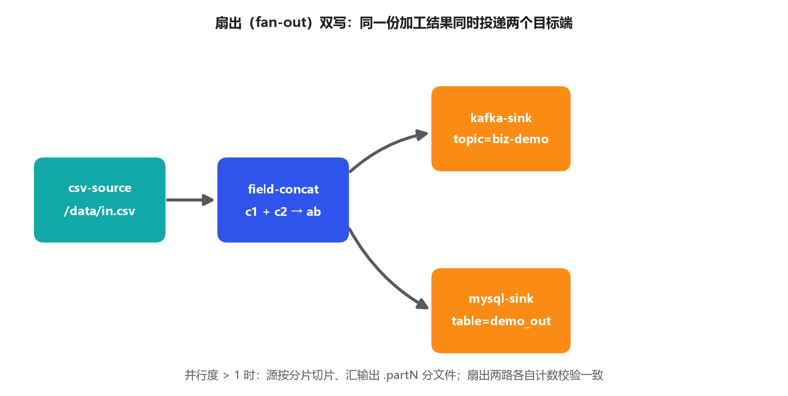
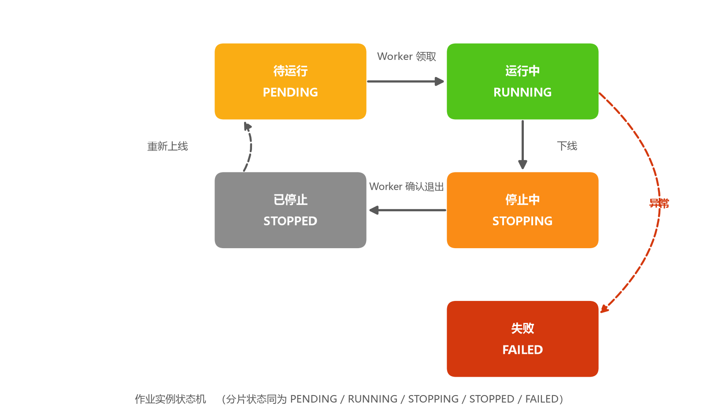
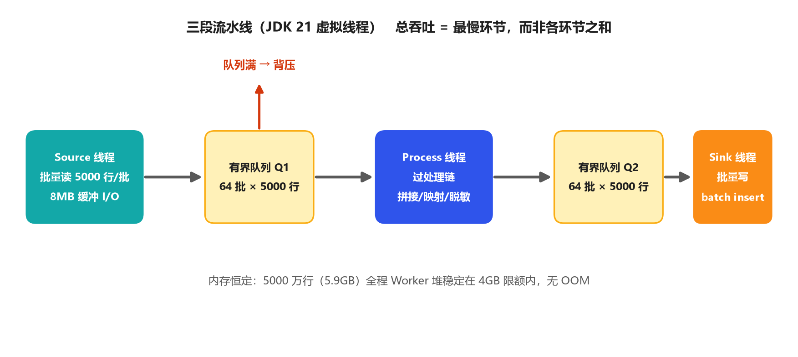

# 通用流处理任务管理平台 —— 概要设计

> 版本：v1.0  对应交付物：《概要设计说明书.docx》

## 1. 项目概述

### 1.1 背景与目标

面向银行科技部门的流式数据加工场景（流量接入、字段补数、格式转换、多路转发等），提供一个**通用流处理任务管理平台**，避免各系统重复建设。用户通过 Web 界面以拖拉拽方式，将「输入控件 → 处理控件 → 输出控件」编排为作业，一键上线后由后端 Worker 集群持续执行。

### 1.2 验收目标映射

| 验收项 | 设计响应 |
|---|---|
| 用户管理 | 用户 CRUD 模块（§4.1） |
| 控件管理（输入/处理/输出三类） | 插件化控件注册中心（§4.2、§5） |
| 作业拖拽编排 | React Flow 画布 + DAG 数据模型（§4.3、§6） |
| 作业上线/下线 | 作业生命周期状态机 + 调度器（§4.4） |
| 基础数据源：MySQL/CSV/Excel/Kafka 输入输出 | 内置 11 个基础控件（4 输入 + 3 处理 + 4 输出，§5.3） |
| XML↔JSON、字段拼接 | 内置处理控件（§5.3） |
| 挑战项：Redis 补数、HDFS/PostgreSQL/Oracle 等多数据源 | 扩展控件（§5.3），SPI 机制支持无限扩展 |
| 横向扩展 | 无状态 Worker 集群 + 作业分片（§7） |
| 性能测试（8VC/32G/机械盘，csv→拼接→csv） | 流水线 I/O 优化设计（§8）+ 测试方案（§9） |

## 2. 总体架构

```
┌──────────────────────────────────────────────────────────┐
│                      前端（React SPA）                    │
│   作业画布(React Flow) │ 用户管理 │ 控件管理 │ 作业监控     │
└──────────────────────────┬───────────────────────────────┘
                           │ REST / JSON
┌──────────────────────────▼───────────────────────────────┐
│              控制面 Control Plane（Spring Boot 3）        │
│  ├─ 用户服务        用户 CRUD、登录鉴权（JWT）             │
│  ├─ 控件服务        控件注册表查询、参数 Schema 下发        │
│  ├─ 作业服务        作业 CRUD、DAG 校验、版本管理           │
│  └─ 调度器          上线/下线、Worker 分配、状态收敛        │
├──────────────────────────────────────────────────────────┤
│              存储与协调层                                 │
│  ├─ MySQL：用户 / 控件 / 作业 DAG / 作业实例 / Worker 节点  │
│  └─（可选）Redis：Worker 心跳、分布式锁、补数控件数据源      │
├──────────────────────────────────────────────────────────┤
│              数据面 Data Plane（Worker 集群，无状态）      │
│  ├─ Worker Agent：注册、心跳、拉取任务、上报状态与指标       │
│  └─ 执行引擎：插件化流水线（Source → Process* → Sink）      │
│        读缓冲 → [批处理管道 + 背压] → 写缓冲                │
└──────────────────────────────────────────────────────────┘
```



**关键设计决策：**

1. **控制面与数据面分离**。控制面只做管理与调度，不碰数据；Worker 独立进程、无状态，可水平扩容，互不感知。
2. **MySQL 即协调中心**。不引入 Zookeeper/Raft，Worker 通过心跳表注册，调度器通过状态字段 + 乐观锁分配任务。简单、可演示、部署文档好写。
3. **控件即插件**。所有控件实现统一 SPI 接口，参数用 JSON Schema 描述，前端根据 Schema 动态渲染参数表单。新增数据源 = 新增一个实现类，不动框架代码。

### 2.1 应用数据流图

一次作业从「编排」到「下线」的完整链路可分为两条流：**控制流**（编排 → DAG 校验 → 分片派发 → 心跳与状态上报）在上，**数据流**（数据源 → 输入控件 → 处理控件 → 输出控件 → 目标端）在下。



该图说明了平台的核心约束：**平台本身不接触数据本体，只负责编排与调度**——数据只在 Worker 的控件流水线内流动，控制面与存储层只承载元数据与调度状态。这也是「控制面可多副本、数据面可任意扩容」的前提。

## 3. 技术选型

| 层 | 技术 | 选型理由 |
|---|---|---|
| 语言 | JDK 21（虚拟线程） | 客户为银行，Java 生态与行内技术栈一致；虚拟线程让流水线并发代码极简 |
| 控制面 | Spring Boot 3、Spring Web、Spring Data JPA | 成熟可靠，开发效率高 |
| Worker | 独立 Spring Boot 应用（内嵌执行引擎） | 与控制面共享控件 SPI 代码，独立部署扩容 |
| 数据库 | MySQL 8 | 题目要求的数据源之一，同时作平台元数据库 |
| 消息队列 | Kafka（KafkaClient 官方客户端） | 题目要求；分区机制天然支持 Worker 横向扩展 |
| 缓存/补数 | Redis（Lettuce） | 挑战项：字段补数控件 + Worker 心跳 |
| Excel | Apache POI（SXSSF 流式写） | 业界标准，流式 API 不占内存 |
| HDFS | Hadoop HDFS Client | 挑战项，Java 原生一等公民 |
| Oracle/PG | 官方 JDBC 驱动 | 挑战项 |
| 前端 | React 18 + React Flow + Ant Design | React Flow 是最成熟的 DAG 拖拽库；AntD 提供管理界面组件 |
| 部署 | Docker Compose（MySQL/Kafka/Redis/控制面/Worker×N） | 一键部署，扩 Worker 只需 `--scale worker=3`，直接演示横向扩展 |

## 4. 模块设计

### 4.1 用户管理

- 用户 CRUD、登录（JWT）、角色（管理员/普通用户，普通用户只能操作自己的作业）。
- 表：`sp_sys_user`。

### 4.2 控件管理

- 控件是平台的原子能力，分三类：**SOURCE（输入）/ PROCESS（处理）/ SINK（输出）**。
- 每个控件在注册表中声明：
  - 元信息：编码、名称、类别、描述、图标；
  - **参数 Schema（JSON Schema）**：描述该控件需要用户填的参数（如 csv 路径、分隔符、Kafka topic），前端据此动态渲染参数表单；
  - 实现类全限定名（SPI 加载）。
- 平台提供「控件列表」页面展示所有可用控件及其参数说明。作业保存时对每个节点参数做 Schema 校验。

### 4.3 作业管理（编排）

- 作业 = 一张**有向无环图（DAG）**，节点是控件实例（含参数），边是数据流向。
- 前端 React Flow 画布拖拽生成 DAG，保存为 JSON（见 §6）。
- 保存时校验：图无环、SOURCE 开头、SINK 结尾、PROCESS 在中间、参数通过 Schema 校验（字段级类型推导为增强项）。
- 作业有版本号，每次修改生成新版本，上线锁定版本。

下图为一个「扇出双写」作业的 DAG 示例：`csv-source → field-concat →（kafka-sink ∥ mysql-sink）`，同一份加工结果同时投递两个目标端。



### 4.4 作业调度（上线/下线）

作业状态机：

```
待运行 PENDING ──Worker 领取──▶ 运行中 RUNNING
                                                          │
            ◀──已停止 STOPPED ◀──Worker 确认退出── 停止中 STOPPING ◀──下线──┘
                                                          │
                                              异常 ──▶ 失败 FAILED
```



- **上线**：控制面将作业置为 PENDING，写入 `sp_job_instance`（含并行度）。
- **Worker 领取**：Worker 心跳时拉取分配给自己的任务；调度器按「分片键」把任务派给存活 Worker（§7）。
- **下线**：置为 STOPPING，Worker 收到指令后优雅停止（处理完在途批次再退出），上报 STOPPED。
- **状态收敛**：Worker 心跳超时（如 30s 无心跳）→ 其任务标记为孤儿，由调度器重新派发，实现**故障自愈**（横向扩展方案的另一半故事）。

### 4.5 监控与日志（增强项，服务演示）

- Worker 周期性上报吞吐量（行/s）、已处理行数；控制面聚合展示作业实时速率曲线。
- Worker 日志通过文件 + 控制面按作业查询（v1 简化：HTTP 拉取最近 N 行）。

## 5. 执行引擎与控件 SPI

### 5.1 核心接口

```java
// 一条记录：字段名 -> 值。批处理模型，管道内传递 List<Row>
public record Row(Map<String, Object> fields) {}

public interface Source extends AutoCloseable {
    void open(Map<String,Object> params, Context ctx);
    /** 拉取一批数据；返回空表示 EOF */
    List<Row> poll() throws Exception;
}

public interface Processor {
    void open(Map<String,Object> params, Context ctx);
    List<Row> process(List<Row> batch) throws Exception;
}

public interface Sink extends AutoCloseable {
    void open(Map<String,Object> params, Context ctx);
    void write(List<Row> batch) throws Exception;
}
```

### 5.2 流水线执行模型

```
Source线程 ──poll──▶ [队列Q1(有界)] ──▶ 处理线程(Process链) ──▶ [队列Q2(有界)] ──▶ Sink线程──write──▶ 目的地
   (批量读)            ▲ 背压：队列满则上游阻塞          (批量过管道)              (缓冲批量写)
```



- **三阶段解耦**：读、处理、写各占一个虚拟线程，中间用有界阻塞队列（`ExecutionEngine.QUEUE_CAPACITY = 64` 批，每批 `batchSize` 默认 5000 行，控件参数可配）衔接，I/O 等待时间被完全掩盖。
- **背压**：队列满即天然背压，无需额外机制。
- **批量传递**：控件间按批调用，消除逐行方法调用开销。
- **缓冲 I/O**：文件类控件统一 8MB 缓冲；数据库/JDBC Sink 用 batch insert；Kafka 用批量 producer。

### 5.3 内置控件清单

| 类别 | 基础目标（必做） | 达成 | 挑战目标（加分，按优先级） | 达成 |
|---|---|---|---|---|
| SOURCE | csv、excel、mysql、Kafka | ✅ 4/4 | PostgreSQL、Oracle、Redis(scan)、HDFS 文件 | ✅ PG / ✅ Oracle / ❌ Redis(scan) / ✅ HDFS |
| PROCESS | 字段拼接(A+B→C)、xml→json、json→xml | ✅ 3/3 | **Redis 字段补数**（按 A 字段查 Redis 扩充字段）、字段过滤/映射、表达式计算、数据脱敏、多路分发 | ✅ Redis 补数 / ✅ 字段映射 / ❌ 字段过滤 / ❌ 表达式计算 / ✅ 数据脱敏 / ✅ 多路分发 |
| SINK | csv、excel、mysql、Kafka | ✅ 4/4 | PostgreSQL、Oracle、Redis、HDFS | ✅ PG / ✅ Oracle / ❌ Redis / ✅ HDFS |

> 达成情况按 `sp-components` 的 `META-INF/services` 注册清单核对（共 20 个内置控件：7 输入 + 6 处理 + 7 输出）。
> 未实现项均为**挑战目标**（非必做）：Redis 作为独立输入/输出控件未做，Redis 能力通过「Redis 字段补数」处理控件提供；
> 字段过滤与表达式计算未做（数据处理类需求可用「字段映射」「数据脱敏」组合覆盖）。

## 6. 核心数据模型

### 6.1 作业 DAG JSON（存 `sp_job.dag_json`）

```json
{
  "nodes": [
    {"id": "n1", "componentCode": "csv-source",
     "params": {"path": "/data/in.csv", "delimiter": ",", "hasHeader": true}},
    {"id": "n2", "componentCode": "field-concat",
     "params": {"sourceFields": ["A", "B"], "targetField": "C", "separator": ""}},
    {"id": "n3", "componentCode": "csv-sink",
     "params": {"path": "/data/out.csv"}}
  ],
  "edges": [{"from": "n1", "to": "n2"}, {"from": "n2", "to": "n3"}]
}
```

### 6.2 主要表（详见《数据库设计说明书》）

| 表 | 说明 |
|---|---|
| `sp_sys_user` | 用户 |
| `sp_component_def` | 控件注册表（编码、类别、参数 Schema、实现类） |
| `sp_job` | 作业（名称、dag_json、版本、并行度、创建人） |
| `sp_job_instance` | 作业运行实例（作业版本快照、状态、分片信息、指派 Worker） |
| `sp_worker_node` | Worker 节点（地址、心跳时间、状态） |

## 7. 横向扩展方案

**目标**：扩机器/扩节点即可提升吞吐量，且可演示、可量化。

1. **Worker 无状态**：Worker 不存任何作业数据，只持执行上下文；启动即注册，扩缩容无损。
2. **作业分片**：作业声明并行度 N，调度器生成 N 个分片实例，按负载派给存活 Worker：
   - **文件场景（字节切片）**：CSV/HDFS 源按字节偏移切片（按行边界对齐，ShardUtils），多个 Worker 并行读互不重叠的区段；CSV/HDFS 输出按分片写 `.partN` 分文件，下游自行合并；
   - **Excel 场景（行区间切片）**：xlsx 是 ZIP 压缩容器，sheet1.xml 被 deflate 压缩，无法按字节随机定位，故改用**数据行序号**切分：先读工作表首部 `<dimension>` 得到总行数（缺失时退回一次只数 `<row>` 的计数扫描），分片 i 只负责 `[总行数*i/N, 总行数*(i+1)/N)`；每个分片仍从文件头顺序解析，但**不在自己区间内的行直接跳过**（不累积单元格、不查共享字符串表、不入队），越过区间末尾立即中断解析。Excel 输出同样按 `.partN` 写分文件。
     - **不重不漏的保证**：区间首尾相接且从 0 起，末分片不设上界（读到文件尾为止），因此行数探测即便偏大或偏小，每行仍恰好被一个分片处理；
     - **如实说明的边界**：由于 xlsx 不可随机定位，分片无法省掉「从头 tokenize 到自己区间末尾」的解析开销，故 Excel 源的加速主要体现在处理与写出环节，输入侧 I/O 不随分片数线性下降；表头行由每个分片各读一次（仅一行，开销可忽略）。
   - **Kafka 场景**：每个分片是同一消费组的一个消费者，靠 Kafka rebalance 自动分配分区，扩 Worker = 扩消费者，吞吐随分区数增长（并行度不宜超过分区数，否则空转）；
   - **数据库场景（分片列取值区间切片）**：数据库输入是流式结果集、没有行号语义，既不可按字节也不可按行号切分，故按**分片列的取值区间**切分：先探测 `SELECT MIN(c), MAX(c) FROM (用户SQL)`，再把 `[min, max]` 均分为 N 段，分片 i 执行 `SELECT * FROM (用户SQL) WHERE c >= 下界 AND c < 上界`。分片列由参数 `shardColumn` 显式声明（数值型列名）；**未声明则控制面拒绝并行度>1**——宁可拒绝，也不能放行后让每个分片各读一遍全量、产生 N 倍重复数据。
     - **为什么不用取模/窗口函数**：`MOD(c,N)=i` 与 `ROW_NUMBER() OVER (ORDER BY …) % N` 都用不上索引（后者还多一次全量排序），每个分片仍要全表扫，数据库侧负载反而变成 N 倍；区间谓词在分片列有索引时可走 range scan，才真正让数据库侧负载随分片数下降。
     - **不重不漏的保证**：相邻边界由同一表达式求值（舍入后仍严格相等），区间首尾相接；末分片不设上界，因此边界探测即便偏大或偏小，每行仍恰好归一个分片。分片列为 NULL 的行与任何区间比较都是 UNKNOWN、会同时落在所有分片之外，故由**首分片**额外以 `OR c IS NULL` 承接（这是最容易静默丢数据的地方）。
     - **如实说明的边界**：① 分片列需为数值型、且必须出现在查询结果列中；② 每个分片各做一次 MIN/MAX 探测，等于 N 次聚合扫描；③ 分片列分布倾斜时各分片负载不均（取值全相同时数据整体落末分片）；④ 不支持断点续传（JDBC 源 `progress()` 仍返回 -1），语义保持 at-least-once；⑤ 汇侧为纯 INSERT、无 truncate，多分片并发写同一张表安全，但分片重试可能产生重复行，需下游幂等。
3. **故障自愈**：Worker 心跳超时 → 分片重新派发，新节点自动接管。
4. **演示路径**：`docker compose up --scale worker=1` 跑一次基准 → `--scale worker=3` 再跑 → 报告中给出吞吐对比（实测加速比数据见 docs/05 §4.2：1000 万行 4 分片 2.4 倍、5000 万行 6 分片×3 Worker 3.3 倍）。

### 7.1 分片与断点续传支持矩阵

> 下表逐控件列出**分片方式**与**断点续传**能力，可直接对照源码核验
> （`Source.progress()` 默认返回 `-1` 表示不支持；未覆写该方法的源即不支持断点续传）。
> **分片 ≠ 断点续传**：HDFS 与 JDBC 源均可分片，但不支持断点续传。

| 源控件 | 分片方式 | 断点续传 | 机制 |
|---|---|---|---|
| `csv-source` | 字节区间（行边界对齐） | ✅ 支持 | `progress()` 返回已读**字节偏移**，崩溃后从该偏移续读 |
| `excel-source` | 行区间（读 `<dimension>` 定行数） | ✅ 支持 | `progress()` 返回已读**行号** |
| `kafka-source` | 分区（消费组 rebalance 自动分配） | ✅ 支持 | 实现 `AckAware`：一批被**全部 Sink 写完**才 `commitSync` 提交消费位点 |
| `hdfs-source` | 字节区间 | ❌ 不支持 | 未覆写 `progress()`，语义 at-least-once（分片重跑从区间起点重读） |
| `mysql-source` / `postgresql-source` / `oracle-source` | 分片列取值区间 | ❌ 不支持 | 同上；已如实列入 §7「数据库场景」的边界④ |

> 上报的断点是**「该批被全部 Sink 写完」的确认偏移**，而非 Source 的实时预读位置——
> 后者会因队列缓冲而超前，恢复时将跳过尚未写出的行（这是 t09 测试发现并修复的高危缺陷，见 docs/12）。
> 控制面仅在断点 `≥ 0` 时落库，故不支持断点的源在 `sp_job_shard.progress` 上保持默认值 0。

**语义统一说明**：不支持断点续传的源在分片重派后从分片起点重新读取，**不会丢数据，但可能重复**，
整体语义为 **at-least-once**；下游需按主键幂等（upsert）去重。

## 8. 性能设计（针对验收场景：csv→拼接→csv @ 8VC/32G/机械盘）

该场景为**纯 I/O 密集型**，优化全部围绕 I/O：

| 手段 | 说明 |
|---|---|
| 大块缓冲 I/O | 读 8MB BufferedInputStream + 写 8MB BufferedOutputStream，保持机械盘纯顺序访问，逼近 100~150MB/s 物理上限 |
| 三阶段流水线 | 读/处理/写并行，总吞吐 = max(读, 处理, 写)，而非三者之和 |
| 批处理模型 | 5000 行/批过管道，消除逐行开销；拼接为纯内存操作，单批毫秒级 |
| 轻量自研解析 | 自研轻量 csv 解析：按分隔符切分，无引号行走快速路径、不用正则，有引号行按 RFC 4180 处理，避免第三方 csv 库的额外开销 |
| 预期指标 | 输入 1GB csv（约千万行）：**单分片**流水线 30~40s 量级；**多分片**可进入 10~20s 量级（实测见下方说明） |

> 说明：上表为**设计预期**。**实测结果**（2026-10-04 批次，测试机 A）：
> 1000 万行**单分片 38.5s / 26.0 万行/s**，**4 分片 16.2s / 61.7 万行/s**。
> 即：单分片受单条流水线串行度限制，**达不到 50 万行/s**，该量级的吞吐需通过分片达成。
> 完整数据、两类实测环境的差异与瓶颈分析（本环境瓶颈在 CPU、磁盘未饱和）见《05-性能测试报告》§4。

## 9. 性能测试方案（对应《性能测试报告》）

- **环境**：赛题基准环境 8vCPU / 32GB / 300GB 机械硬盘，Docker Compose 部署；实测环境与替代说明见《05-性能测试报告》§2，**环境参数的权威定义见《部署文档》§8 运行环境说明**。
- **数据集**：程序生成 100万 / 1000万 / 5000万行三档 csv（每行 10 字段）。
- **场景**：csv 读取 → 字段拼接 → csv 写出；MySQL→MySQL、Kafka→Kafka 作为补充场景。
- **指标**：总耗时、吞吐（行/s、MB/s）、CPU/内存/磁盘 util（`iostat`）。
- **对比实验**：单 Worker vs 3 Worker（横向扩展验证）；批大小/缓冲大小敏感性分析。
- **报告结构**：环境说明 → 测试方法 → 结果表格与曲线 → 瓶颈分析（证明瓶颈在磁盘而非平台）→ 结论。

## 10. 实施计划

| 阶段 | 内容 | 产出 |
|---|---|---|
| P1 设计 | 概要设计、数据库设计定稿 | 两份设计说明书（P1 首版，后续阶段持续定稿） |
| P2 骨架 | 工程搭建、用户/控件/作业 CRUD、拖拽画布、DAG 保存 | 可运行的管理平台 |
| P3 主链路 | Worker 引擎 + csv/拼接控件 + 上线/下线调度 | 端到端 demo |
| P4 基础控件 | MySQL/Excel/Kafka 输入输出、XML↔JSON | 基础验收全覆盖 |
| P5 挑战项 | Redis 补数、PG/Oracle/HDFS、多 Worker 扩展、监控 | 挑战验收 |
| P6 测试与交付 | 性能测试、报告、部署文档、演示视频 | 全部交付物 |

## 11. 交付物清单映射

| 交付物 | 来源 |
|---|---|
| 项目创意与价值分析.docx | 《00-项目创意与价值分析.md》排版 |
| 概要设计说明书.docx | 本文档排版 |
| 数据库设计说明书.docx | 《02-数据库设计.md》排版 |
| 部署文档.docx | 基于 Docker Compose 实测步骤整理 |
| 性能测试报告.docx | §9 方案实测数据整理 |
| 完整测试报告.docx | 《08/10/11/12》合册 |
| 作品演示录像.mp4 | 拖拽建作业 → 上线 → 监控 → 扩容对比，5 分钟脚本 |
| 项目源码包.zip | 前后端完整源码 |
