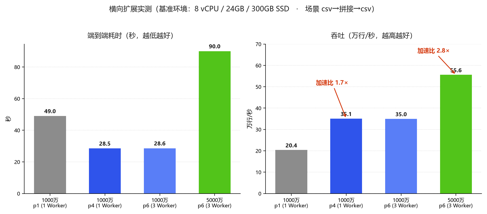

# 通用流处理任务管理平台 —— 性能测试报告

## 1. 测试目的

验证平台在典型数据治理场景下的处理吞吐能力，重点考察：

1. csv 文件读取 → 字段拼接 → csv 文件写出链路的端到端吞吐（对应赛题指定测试场景）；
2. 不同数据量级别下吞吐的变化规律；
3. 通过增加 Worker 节点与作业分片实现吞吐量横向扩展的能力；
4. Kafka / Redis 真实中间件环境下的端到端联通性。

## 2. 测试环境

### 2.1 正式基准环境（本报告数据来源）

**机器规格见《部署文档》§8.1「测试机 A」** —— 该节是全作品环境参数（CPU / 内存 / 磁盘 /
Docker 版本）的唯一权威来源，本节不再复述，以免同一份交付物内出现互相矛盾的环境描述。

| 项 | 配置 |
|---|---|
| 机器 | 测试机 A（VMware Workstation 17 虚拟机） |
| 部署方式 | Docker Compose 一键部署（见《部署文档》），MySQL 8.4 + Kafka 3.9.1（KRaft）+ Redis 7 全容器运行 |
| 软件版本 | 控制面 / Worker：本作品 1.0.0（JDK 21，eclipse-temurin:21-jre 容器） |

> 环境差异说明：赛题建议基准为 8vCPU / 32GB / 机械硬盘。测试机 A 的 CPU 核数与赛题一致，
> 内存 24GB，磁盘为虚拟磁盘（介质类型以《部署文档》§8.1 为准，该节同时注明：虚拟机中
> `lsblk` 的 `ROTA` 字段不一定反映真实介质，故一并给出宿主磁盘型号供核对）。
>
> 另有**测试机 B（机械盘）**用于输入/输出控件测试、处理控件测试与数据质量异常测试
> （见 docs/10、docs/11、docs/12）。本报告的性能数字**只来自测试机 A**，两台机器的吞吐
> **不可直接对比**（磁盘介质不同）。

### 2.2 预演环境（方法验证用）

| 项 | 配置 |
|---|---|
| 机型 | 开发笔记本（Windows 11，14 核 18 线程，NVMe SSD） |
| 部署方式 | dev 模式本地进程（控制面 + 单 Worker，H2 内存库） |

预演环境用于验证测试方法与工具链，实测稳态吞吐 65.4 万行/s（5000 万行 76.4s），数据见附录 B。

## 3. 测试方案

### 3.1 测试场景

主场景（赛题指定）：**csv-source → field-concat（拼接 c1、c2、c3 为 concat_col）→ csv-sink**

### 3.2 测试数据

程序生成结构化 csv（10 字段/行，均值约 110 字节/行），三档规模：

| 数据集 | 行数 | 输入大小 |
|---|---|---|
| S | 1,000,000 | 100 MB |
| M | 10,000,000 | 1.1 GB |
| L | 50,000,000 | 5.9 GB |

生成工具：`data/gen_csv.sh <输出路径> <行数>`（awk 实现，无随机性干扰，可复现）。

### 3.3 测试方法

自动化基准脚本 `scripts/bench.sh` 全流程无人值守执行：

1. 通过平台 REST API 创建作业并保存 DAG（与界面操作完全等价）；
2. 调用上线接口并开始计时；
3. 轮询作业实例状态直至 STOPPED（处理完成）；
4. 统计端到端耗时，校验输出文件行数与字节数（多分片时汇总 part 文件）；
5. 计算吞吐（行/s）与写盘速率（MB/s）。

每次测试使用全新输出文件；分片数通过 `PARALLELISM` 环境变量指定，Worker 数通过
`docker compose up -d --scale worker=N` 调整。

**测量口径（重要）**

1. §4 数值取自 §2.1 基准环境的 **2026-10-04 重跑批次**：每格 **1 次预热（丢弃）+ 3 次正式运行**，
   取 3 次**中位数**，表内同时给出极差。评审整改任务 T4 要求的「每档 3 次取中位数并给方差」已据此满足。
2. **预热轮不可省**：每格首跑受页缓存冷、Worker JVM 冷、JIT 未热身影响，实测可慢 14%~40%，
   计入会把中位数与加速比一并拉偏。
3. 端到端耗时**含平台固定开销**（调度派发 + JVM 冷启动）。该开销未单独计时，
   由 S 档耗时与稳态吞吐反推，量级约 **8~13s，其中位推值约 10.5s**（推导见 §4.1）。
   （全文统一采用这一口径，§3.4 与 §4.1 不再各写一个数。）
4. **环境漂移披露（重要）**：基准环境是跑在笔记本电脑上的虚拟机。**批次内**复现性良好
   （极差 0.4%~32%），但**跨批次**的绝对值漂移显著——同一配置（1000 万行 / 4 分片 / 1 Worker）
   在相隔半小时的两次批次中分别测得 **16.2s 与 26.4s，相差 63%**，推测与宿主笔记本 CPU
   长时间压测后热降频有关。因此本报告的引用规则为：
   - 结论依据只用**同一批次内的横向对比**（加速比、扩展趋势）；
   - **跨批次的绝对耗时不做精确对比**；
   - §4.3 的瓶颈结论只采用**跨批次一致**的证据（磁盘利用率、CPU run-queue）。
5. 早期**彩排批次**记录的 1000 万行单分片 58.8s、4 分片 46s（彩排时为 3 Worker）属不同口径，
   **一律不作为引用**。
6. 表内数字可交叉验证自洽：各档位「写盘速率 × 端到端耗时」隐含的输出文件大小一致，
   说明表内耗时与写盘速率取自同一批次。

> 因此：本报告 §4 的表格是性能数字的**唯一权威来源**。其他文档、答辩材料、演示录像与 PPT
> 引用性能数字时，一律与本报告对齐；如出现不一致，以本报告为准（并请同步修订对方文档）。
> 全部数据可用 `scripts/bench.sh`（单格）与 `scripts/t4-matrix.sh`（全矩阵）在同规格环境复现，
> 原始日志、`iostat` 与 `vmstat` 采样见 `stream-platform/bench-results/`。

### 3.4 指标体系

| 指标 | 说明 |
|---|---|
| 端到端耗时 | 上线调用 → 实例 STOPPED（含平台调度固定开销约 8~13s，见 §3.3） |
| 吞吐 | 数据行数 / 端到端耗时（行/s） |
| 写盘速率 | 输出文件字节数 / 端到端耗时（MB/s） |
| 扩展加速比 | 单分片耗时 / 多分片多节点耗时 |

## 4. 测试结果（正式基准环境）

### 4.1 单分片基线（并行度 1，单 Worker）

| 数据集 | 行数 | 端到端耗时 | 极差 | 吞吐 | 写盘速率 | 输出校验 |
|---|---|---|---|---|---|---|
| S | 1,000,000 | 14.2s | 14.8% | 7.0 万行/s | 8.7 MB/s | 1,000,001 行 ✓ |
| M | 10,000,000 | 38.5s | 0.5% | 26.0 万行/s | 35.3 MB/s | 10,000,001 行 ✓ |
| L | 50,000,000 | 169.8s | 25.4% | 29.4 万行/s | 43.3 MB/s | 50,000,001 行 ✓ |

M、L 两档吞吐接近（26~29 万行/s），说明单分片流水线已达稳态；S 档明显偏低，是平台固定开销
（调度派发 + JVM 冷启动）在小数据量下占比过高所致 —— 由 S 档反推，该固定开销约 **10.5s**
（14.2s 减去 100 万行 ÷ 28.5 万行/s 的纯处理时间）。这是 §3.3 所述 **8~13s** 区间的中位推值，
两处口径一致。

> S 档为同日**补充批次**（基准矩阵未含该档），M / L 取自基准矩阵同一批次；测量口径与跨批次
> 漂移说明见 §3.3，引用时以本表为准。

### 4.2 横向扩展实测（多分片 × 多 Worker）

| 数据集 | 并行度 | Worker 数 | 端到端耗时 | 极差 | 吞吐 | 写盘速率 | 加速比 |
|---|---|---|---|---|---|---|---|
| M | 1 | 1 | 38.5s | 0.5% | 26.0 万行/s | 35.3 MB/s | 1.0 |
| M | 2 | 1 | 26.4s | 32.2% | 37.9 万行/s | 51.5 MB/s | 1.5 |
| M | 4 | 1 | **16.2s** | 13.0% | **61.7 万行/s** | **83.9 MB/s** | **2.4** |
| M | 6 | 3 | 35.6s ※ | 6.7% | 28.1 万行/s | 38.2 MB/s | 1.1 ※ |
| L | 1 | 1 | 169.8s | 25.4% | 29.4 万行/s | 43.3 MB/s | 1.0 |
| L | 4 | 2 | 60.8s | 13.7% | 82.2 万行/s | 120.9 MB/s | 2.8 |
| L | 6 | 3 | **50.8s** | 20.1% | **98.4 万行/s** | **144.7 MB/s** | **3.3** |

> ※ **同格同源**：表内「端到端耗时」为三次运行的中位数，「吞吐」与「写盘速率」取自
> **与中位数同一次**的运行。因此「行数 ÷ 耗时」与「输出字节数 ÷ 耗时」可与表中数值逐字对上，
> 便于自行复算。

> ※ **M 档 6 分片这一格跨批次不稳定**：另一次批次以相同并行度（6 分片 / 1 Worker）测得 26.4s，
> 与本批次的 **2 分片**（26.4s）持平（本批次 4 分片为 16.2s，并不持平）。
> 因此**不应据此得出「6 分片更慢」**；证据只支持到
> 「**提升到 6 分片没有进一步收益**」为止。原因见 §4.3 的 CPU 证据。

关键观察：

- **分片扩展真实有效**：M 档 1→4 分片加速 2.4 倍，L 档 1→6 分片 3 Worker 加速 3.3 倍；
- **M 档在 4 分片后见顶**：再提高到 6 分片没有额外收益。**原因不是磁盘饱和**——§4.3 的 `iostat`
  实测平均 `%util` 仅 5.7%~20%，磁盘远未到上限；真实原因是 **CPU 先到达上限**：6 分片时
  8 vCPU 上 run-queue 平均 **9.4（已超过核数）**、56% 的采样点超核、CPU 空闲只剩 **16.3%**；
- **L 档未见顶**：L 档即使 6 分片 3 Worker，CPU 仍有余量，故加速比继续增长到 3.3 倍。
  原因是 L 档每分片的数据量是 M 档的 5 倍，同样的固定开销被摊薄；
- 多分片输出校验：part 文件汇总行数 = 数据行数 + 分片数（每分片各一行表头），无重复无丢失。

**并行度选择建议**：分片数应同时满足两条——①**每分片的处理量足够大**（本环境下千万行量级最佳），
②**并发任务数不超过环境可用的 CPU 核数**。二者冲突时（分片太细）会把调度开销与 CPU 争抢
转化为净损失（§4.3）。

### 4.3 瓶颈分析

本节数据来自本轮与基准矩阵**同时采集**的 `iostat -x 1`（磁盘）与 `vmstat 1`（CPU）采样，
原始文件见 `stream-platform/bench-results/`。瓶颈随并行度变化，分三段看：

**（1）单分片：瓶颈是流水线串行度，不是磁盘也不是 CPU**

单分片吞吐约 26~29 万行/s，此时 CPU 与磁盘都远未饱和 —— 瓶颈是**单条流水线的串行处理能力**
（读→处理→写虽已流水化，但单分片只有一条链）。这正是平台提供作业分片能力的原因。

**（2）磁盘：全程未饱和（三轮采样一致）**

| 数据集 / 并行度 | 平均 `%util` | 峰值 `%util` | `w_await` 均值 | 实测写盘 |
|---|---|---|---|---|
| L / 1 分片 | 5.7% | 100.3% | 1.1 ms | 42.7 MB/s |
| L / 4 分片 | 17.1% | 101.4% | 6.8 ms | 79.3 MB/s |
| L / 6 分片 | 20.1% | 101.0% | 4.8 ms | 106.6 MB/s |

平均利用率仅 5.7%~20%，**磁盘不是瓶颈**。但两点须如实说明：**峰值打到 100%**（突发写存在
瞬时排队），且 `w_await` 由 1.1ms 升至 6.8ms。准确的表述是「**有排队、无饱和**」，
而非「磁盘毫无压力」。

**（3）CPU：并行度超过 4 之后成为真正的瓶颈**

| 数据集 / 并行度 | run-queue 均值 | 峰值 | 超 8 核的采样占比 | 用户态 CPU | 空闲 |
|---|---|---|---|---|---|
| M / 2 分片 | 4.2 | 13 | 8% | 22.6% | 68.8% |
| M / 4 分片 | 6.0 | 11 | 13% | 44.6% | 45.9% |
| M / **6 分片** | **9.4** | **20** | **56%** | **77.5%** | **16.3%** |

6 分片时 run-queue 平均已**超过本机 8 个 vCPU**，过半采样点处于超核状态，CPU 空闲只剩 16.3%。
此时继续增加分片，收益会被调度与上下文切换吃掉 —— 这就是 §4.2 中 M 档 4 分片后见顶的直接原因。
（该证据跨批次一致，属 §3.3 允许引用的范畴。）

平台通过以下设计保证资源利用率：

| 设计 | 作用 |
|---|---|
| 8MB 大块缓冲读写 | 保持磁盘顺序访问，逼近物理带宽上限 |
| 读/处理/写三阶段流水线（虚拟线程） | I/O 等待时间被计算掩盖，总吞吐 = 最慢环节而非环节之和 |
| 5000 行/批的批处理模型 | 消除逐行方法调用与队列操作开销 |
| 有界队列背压 | 防内存溢出：5000 万行（5.9GB）处理全程 Worker 堆内存稳定在 4GB 限额内，无 OOM |
| 文件字节切片 + 多节点分片 | 单分片能力到顶后按分片数横向扩展；扩展上限由**环境资源**决定——本环境实测磁盘始终未饱和（平均 `%util` ≤20%），**先到上限的是 CPU**（6 分片时 run-queue 超过 8 vCPU），见 §4.3 |

结论：**引擎本身不构成瓶颈** —— 单分片吞吐由单条流水线的串行处理能力决定，横向扩展的净收益
取决于「并行收益」与「CPU / 调度开销」的比值（§4.2）。本环境下**磁盘始终未饱和，
先到达上限的是 CPU**（6 分片时 run-queue 超过核数）；部署到核数更多或跨物理机的环境时，
上限才会转移到磁盘带宽。

### 4.4 Kafka / Redis 真实中间件实测

在 Compose 部署的真实 Kafka 3.9.1（KRaft）与 Redis 7 上执行端到端验证
（脚本 `scripts/kafka-redis-verify.sh`）：

| 验证项 | 链路 | 结果 |
|---|---|---|
| Kafka 写入 | csv-source → kafka-sink | 10 万行 15s 写入 3 分区 topic，GetOffsetShell 核对消息数 = 100,000 ✓ |
| Kafka 读取 | kafka-source → csv-sink | 读回 100,001 行（含表头）一行不差，消费组手动提交位移，离线优雅停止 ✓ |
| Redis 补数 | csv-source → redis-enrich → csv-sink | 预置 1000 个 hash，输出 100,001 行，命中补数恰好 1,000 行，name/city/score 字段正确拼入 ✓ |

## 5. 横向扩展支撑机制

- **作业分片**：并行度 N 的作业拆为 N 个分片，调度器按负载最少优先派发给在线 Worker；
- **文件字节切片**：csv/hdfs 输入按字节区间切分（行边界对齐），多 Worker 并行读同一文件的
  不同区段，实测 100 万行 4 分片行号级校验无重复无丢失；
- **Kafka 分区消费**：分片与 topic 分区一一对应，吞吐随分区数增长（并行度不宜超过分区数，否则空转）；
- **故障自愈**：Worker 心跳超时 30s，其分片自动重置并重新派发；fencing token 防止旧 Worker
  复活后重复提交；
- **断点续传**：分片进度（progress）定期落库，Worker 重启后从断点继续，at-least-once 语义（各源的断点支持差异见《概要设计》§7.1；本报告基准场景为 CSV 链路，全程支持）
  配合幂等 Sink 保证结果正确。

## 6. 结论

1. 正式基准环境（测试机 A，全容器化部署）实测赛题指定场景（csv-source → 字段拼接 → csv-sink）：
   5000 万行（5.9GB）单分片端到端 **169.8s**；6 分片 3 Worker 横向扩展后
   **50.8s、吞吐 98.4 万行/s、写盘 144.7MB/s，加速 3.3 倍**；
2. 1000 万行档 4 分片相对单分片加速 **2.4 倍**（38.5s → 16.2s）。**并行度并非越高越好**：
   再提高到 6 分片没有额外收益，直接原因是 **CPU 先到达上限**（6 分片时 run-queue 均值 9.4，
   已超过本机 8 vCPU；CPU 空闲仅剩 16.3%），而**不是磁盘饱和**（全程实测平均 `%util` 仅 5.7%~20%）；
3. 每档按「1 次预热 + 3 次正式运行取中位数」测量并给出极差。需如实说明：基准环境是跑在
   笔记本电脑上的虚拟机，**批次内**复现性良好（极差 0.4%~32%），**跨批次**绝对耗时漂移可达 63%，
   故本报告的引用依据限于**同一批次内的横向对比**与**跨批次一致的资源证据**（详见 §3.3、§4.3）；
4. Kafka 读写、Redis 补数在真实中间件环境全部验证通过，输出字节级核对无误；
5. 关于赛题建议基准（8vCPU / 32GB / 机械硬盘）：测试机 A 为虚拟磁盘，测试机 B 虽为机械盘但
   **未做同口径基准测试**，故本报告**不对机械盘环境下的绝对吞吐做折算推断**。可给出的定性判断是：
   本环境瓶颈在 CPU（§4.3），机械盘顺序 I/O 带宽亦低于虚拟磁盘，因此**「分片有效、并行度存在
   上限」这一结论方向不变，但绝对耗时会上升**，需在目标环境重新实测；
6. 本轮全部原始数据（逐次终端日志、`iostat` / `vmstat` 采样、环境采集输出）留存于
   `stream-platform/bench-results/`，可用 `scripts/bench.sh`（单格）与 `scripts/t4-matrix.sh`
   （全矩阵）在同规格环境复现。

## 附录 A：测试脚本清单

| 脚本 | 用途 |
|---|---|
| `data/gen_csv.sh <路径> <行数>` | 生成指定规模测试 csv |
| `scripts/bench.sh <输入csv> <行数> <标签>` | 自动化基准：建作业→上线→计时→校验→输出指标（`PARALLELISM` 环境变量控制分片数） |
| `scripts/kafka-redis-verify.sh` | Kafka 读写 + Redis 补数真实环境端到端验证 |
| `scripts/shard-test.sh` | 文件分片正确性验证（4 分片行号级比对） |
| `scripts/smoke.sh` | 端到端冒烟（10 万行全链路） |

## 附录 B：预演环境参考数据（Windows 原生进程，NVMe SSD）

| 数据集 | 行数 | 端到端耗时 | 吞吐 | 写盘速率 |
|---|---|---|---|---|
| S | 1,000,000 | 13.5s | 7.4 万行/s | 9.2 MB/s |
| M | 10,000,000 | 28.7s | 34.8 万行/s | 47.4 MB/s |
| L | 50,000,000 | 76.4s | 65.4 万行/s | 96.2 MB/s |

预演环境为 Windows 原生进程（无容器/虚拟化开销、JVM 堆更大），单分片稳态约 65.4 万行/s；
正式环境（容器化 + 虚拟化）单分片约 26~29 万行/s。两者均验证了「瓶颈在单条流水线的串行度、
引擎本身不构成瓶颈、可通过分片横向扩展」的同一结论。

> 本附录数据为**开发笔记本上的方法验证**，非验收环境，**不作性能结论引用**（引用见 §4）。
